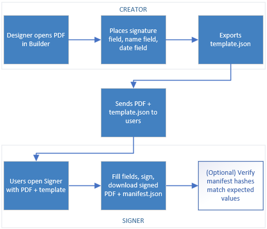
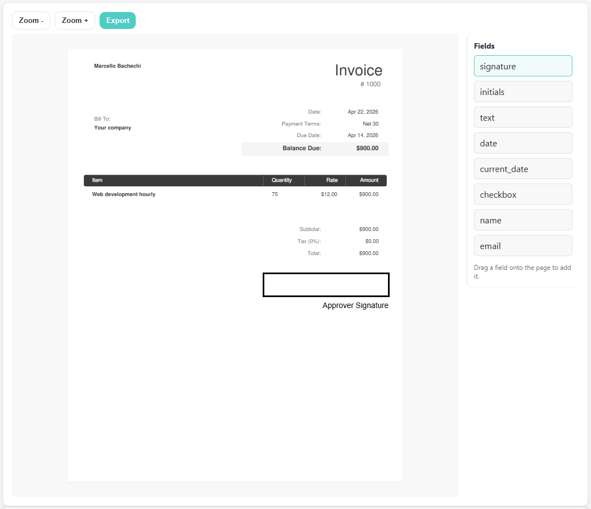
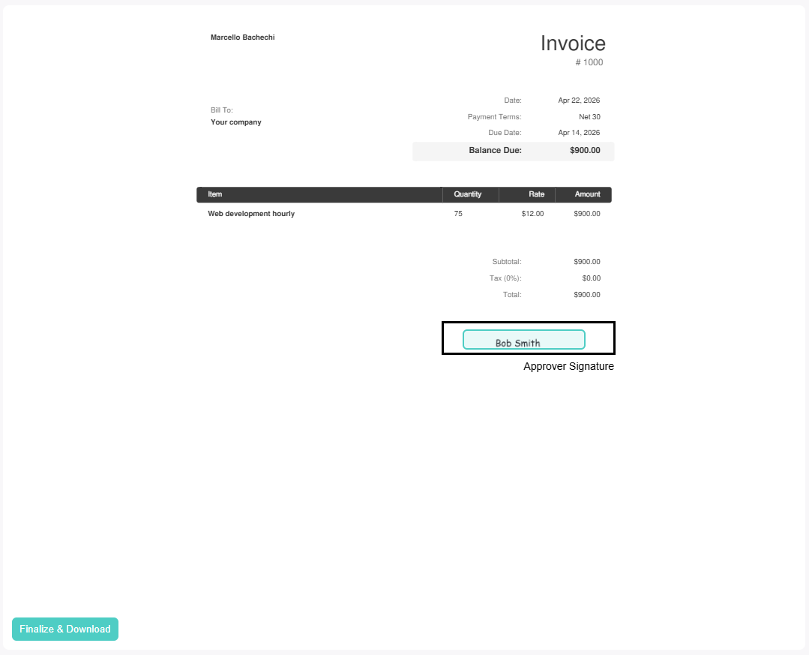

<div align="center">
  
  <br /><br />
  <strong>Client-first Vue 3 toolkit for building PDF form templates and collecting signatures — entirely in the browser.</strong>
  <br /><br />

  [](https://www.npmjs.com/package/@signkit/core)
  [](LICENSE)
  [](https://docs.signkit.dev/)
  [](https://demo.signkit.dev/)

  <br />

  **[Documentation](https://docs.signkit.dev/) · [Live Demo](https://demo.signkit.dev/) · [npm](https://www.npmjs.com/package/@signkit/core)**

  <br />

  [](https://ko-fi.com/P5P22RTZ6)

  *If this project saves you time, please consider supporting it on Ko-fi. It helps keep things maintained and moving forward.*
</div>

---

## What is this?

`@signkit/core` lets you add PDF signing workflows to any web app with two Vue 3 components — no backend, no API keys, no third-party services required.

- **Form Builder** — load any PDF, drag and drop fields (signature, text, date, checkbox, initials) onto the pages, and export a reusable `template.json`.
- **Signer** — load a PDF + template, collect the signer's input, and produce a signed PDF (`Uint8Array`) and a `manifest.json` recording every field value and integrity hashes.

PDF rendering is handled by [pdf.js](https://mozilla.github.io/pdf.js/). PDF generation uses [pdf-lib](https://pdf-lib.js.org/). Both run entirely client-side.

---

## How it works

<div align="center">
  
</div>

1. A **designer** opens a PDF in the Form Builder, places fields, and exports `template.json`.
2. The `template.json` and the original PDF are distributed to signers (however your app handles that).
3. A **signer** opens the Signer with the PDF + template, fills the fields, draws or types their signature, and clicks Finalize.
4. The Signer produces a **signed PDF** and a **manifest JSON** — both stay in the browser unless your app sends them somewhere.

---

## Screenshots

<table>
  <tr>
    <td align="center"><strong>Form Builder</strong></td>
    <td align="center"><strong>Signer</strong></td>
  </tr>
  <tr>
    <td></td>
    <td></td>
  </tr>
</table>

---

## Repository layout

This is an npm workspace monorepo. There are three packages under `packages/`:

| Package | Purpose |
|---|---|
| [`packages/pdf-sign-kit`](packages/pdf-sign-kit) | The publishable library — Vue components, composables, utilities, and types. This is what gets installed from npm as `@signkit/core`. |
| [`packages/demo`](packages/demo) | A minimal Vite + Vue app that showcases the Form Builder, Signer, Integrity checker, and Web Component wrappers side by side. |
| [`packages/docs`](packages/docs) | The [VitePress documentation site](https://docs.signkit.dev/) — getting started, API reference, usage guides, and the integrity/security overview. |

Browser tests (Playwright) live at the repo root in [`tests/e2e/`](tests/e2e/).

---

## Quick start

```bash
# Install all workspace dependencies
npm install

# Run the demo app at http://localhost:5173
npm run dev:demo

# Run the docs site locally
npm run dev:docs

# Run unit tests (Vitest)
npm test

# Run Playwright e2e tests against the demo
npm run test:e2e

# Build the library
npm run build
```

---

## Using the library

Install in your own project:

```bash
npm install @signkit/core
```

Then see the [Getting Started guide](https://docs.signkit.dev/getting-started) and the [package README](packages/pdf-sign-kit/README.md) for component usage, web component setup, and theming.

---

## Other READMEs in this repo

| File | Why you might care |
|---|---|
| [`packages/pdf-sign-kit/README.md`](packages/pdf-sign-kit/README.md) | **Start here if you're installing the package.** Quick-start guide, Vue component usage, Web Component usage, theming, and key type reference. This is what appears on the npm package page. |
| [`tests/README.md`](tests/README.md) | How to run the Playwright e2e tests, what each spec covers, and prerequisites (Chromium, WC bundle). |
| [`packages/pdf-sign-kit/STYLEGUIDE.md`](packages/pdf-sign-kit/STYLEGUIDE.md) | CSS token reference, the `--sk-` naming convention, and how to theme components including Shadow DOM custom elements. |
| [`AGENTS.md`](AGENTS.md) | Guidance for automated coding agents (and human contributors) — project constraints, coding standards, and definition of done. |

---

## Contributing

See [`packages/docs/contributing.md`](packages/docs/contributing.md) for the full guide: dev setup, testing, PR expectations, and how the release pipeline works.

In short: fork, branch, make your change with tests, run `npm test && npm run lint`, open a detailed PR.

In search of the following:
- [ ] Styling improvements
- [ ] Ports for 
  - [x] Vue 
  - [ ] React
  - [ ] Angular
  - [ ] Svelte

---

## License

Apache 2.0 — see [LICENSE](LICENSE).
